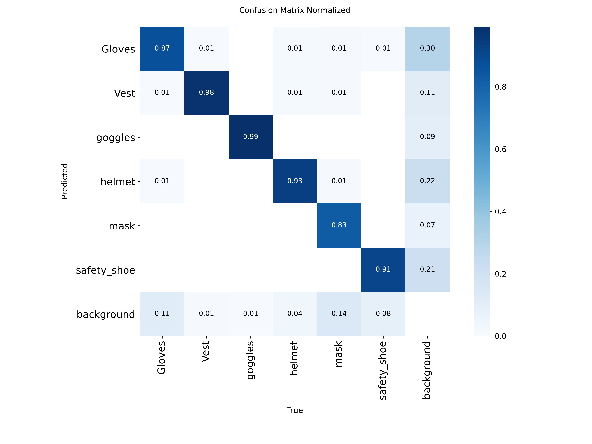
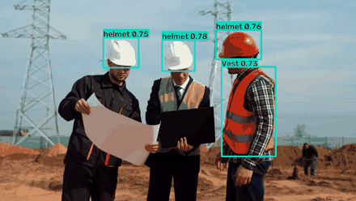
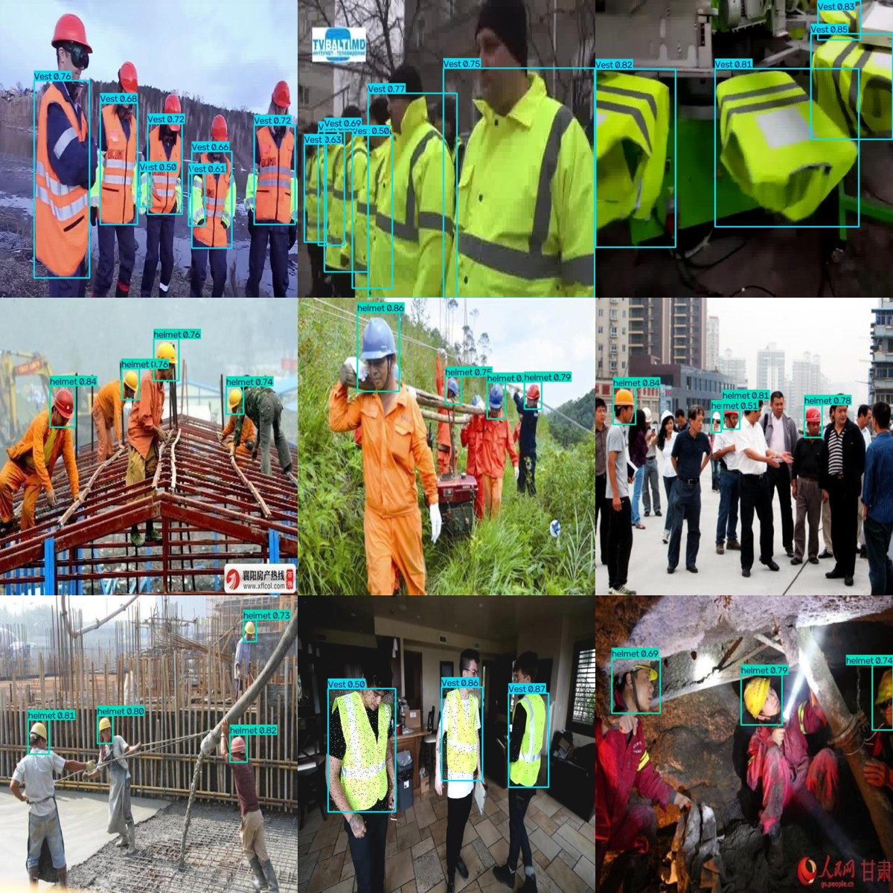
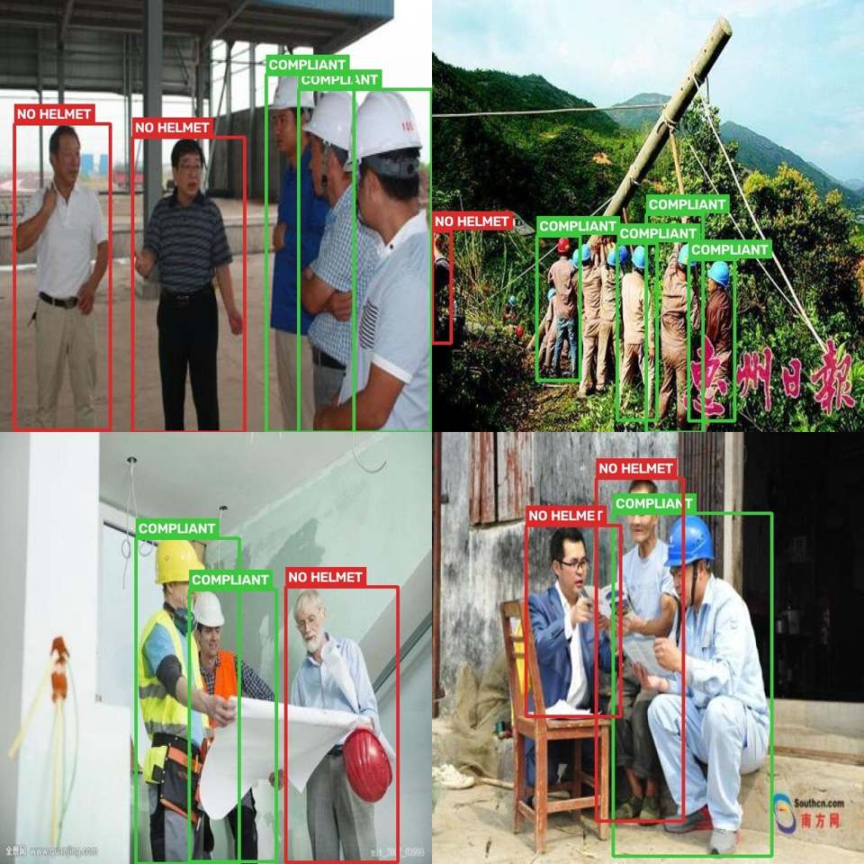

<p align="center">
  
</p>

# PPE Detection 🦺

Detecting **personal protective equipment** — helmet, safety vest, mask, gloves,
goggles, safety shoes — in images and video with **YOLO11**, built to run on a
CPU for edge-style deployment.

> 🚧 **Work in progress** — building this in the open, step by step.

## Why this project

Safety-compliance monitoring is a real, deployed use of computer vision on
construction sites, in factories, and in warehouses. The plan is to take it
end-to-end rather than stop at a notebook: **data → training → evaluation →
optimization → demo → deployment.**

## Dataset

The base dataset is a public PPE collection in YOLO format
([51ddhesh/PPE_Detection](https://huggingface.co/datasets/51ddhesh/PPE_Detection),
CC-BY-4.0), covering six classes: `Gloves, Vest, goggles, helmet, mask, safety_shoe`.

| Split | Images |
|-------|--------|
| Train | 8,774 |
| Val   | 2,070 |
| Test  | 1,234 |

`src/prepare_data.py` gets it ready for training: it extracts the archive,
rewrites the dataset's `data.yaml` to absolute paths (so training works no matter
which directory it's launched from — a common cause of "0 images found" errors),
and prints a quick sanity summary of image counts and class names.

```bash
curl.exe -L -o data/PPE.zip https://huggingface.co/datasets/51ddhesh/PPE_Detection/resolve/main/PPE.zip
python src/prepare_data.py
```

## Training

I fine-tune **YOLO11s** with transfer learning. The `s` (small) variant is a
deliberate choice: it fits comfortably in 8 GB of VRAM with room to spare and
stays light enough to deploy on CPU later, while still being accurate enough for
the task.

`src/train.py` is tuned for a memory-constrained GPU (my RTX 4060 Laptop, 8 GB):

- **Mixed precision (AMP)** — roughly halves VRAM use and speeds training up
- **Batch 16 at 640px** — fills the card without running out of memory
- **Disk caching** instead of RAM caching — keeps the dataset cache off system RAM
- **Early stopping** — halts a plateaued run so no GPU time is wasted

```bash
python src/train.py --epochs 50
```

The script first confirms it's actually training on the GPU (an easy thing to get
wrong), then trains and copies the best weights to `models/best.pt`.

## Results

Trained for 50 epochs and evaluated on the held-out **test** set (1,234 images
the model never saw during training):

| Metric | Value |
|--------|-------|
| mAP@0.5 | **0.812** |
| mAP@0.5:0.95 | 0.520 |
| Precision | 0.847 |
| Recall | 0.745 |

Per class:

| Class | mAP@0.5 |
|-------|---------|
| goggles | 0.947 |
| Vest | 0.940 |
| helmet | 0.891 |
| safety_shoe | 0.726 |
| mask | 0.718 |
| Gloves | 0.652 |

### What the numbers say

The spread is informative rather than uniform. **Vest, goggles and helmet** score
highest — they're large or visually distinctive and well represented in the data.
**Gloves and masks trail** because they're small, high-variance objects with fewer
training instances (masks in particular have only ~86 test instances, so that
figure is noisier). Precision (0.85) sits above recall (0.75), so the model is a
little conservative — when it fires it's usually right, but it misses some of the
harder small objects. For a safety use case you can trade some precision back for
recall by lowering the confidence threshold.

`src/evaluate.py` produces these metrics along with the confusion matrix and
PR/F1 curves.

<p align="center">
  
</p>

## Optimization for the edge

The point of this step is to answer "can it run somewhere real, and how fast?"
`src/export_onnx.py` exports the trained model to ONNX, produces an INT8-quantized
variant, and benchmarks all three so the trade-offs are measured, not assumed.

| Format | Device | Size (MB) | Latency (ms) | FPS |
|--------|--------|-----------|--------------|-----|
| PyTorch `.pt` | GPU | 18.3 | 7.6 | 131 |
| ONNX FP32 | CPU | 36.2 | 60.9 | 16 |
| ONNX INT8 (dynamic) | CPU | 9.4 | 740 | 1.4 |

Two findings:

- **It's edge-deployable.** Exported to ONNX, it runs at **~16 FPS on CPU alone** —
  no GPU required. For safety monitoring that's comfortably real-time.
- **Dynamic INT8 quantization backfired — and I measured it rather than assuming.**
  It shrank the model 4× but made CPU inference ~12× *slower*. Dynamic quantization
  suits weight-bound transformer/RNN operators; YOLO is convolution-bound, so
  ONNXRuntime ends up wrapping each conv in quantize/dequantize steps that cost more
  than they save. The right approach for a CNN is static (calibration-based)
  quantization — noted as future work. For now, FP32 ONNX is the CPU deployment
  target.

Full write-up: [`reports/benchmark.md`](reports/benchmark.md).

## Demo

A Streamlit app (`demo/app.py`) lets you upload an image or a short video and see
the model annotate it live. It runs on the CPU ONNX model, so it works anywhere —
no GPU needed.



*Live detection on an unseen construction-site clip — footage from
[Mixkit](https://mixkit.co/) (free licence), never used in training.*

`src/infer_video.py` runs the same detection from the command line, with
CPU-friendly options (frame-skipping, input downscaling) for smooth inference on
modest hardware:

```bash
streamlit run demo/app.py                            # interactive demo
python src/infer_video.py --source clip.mp4 --frame-skip 2
```

Predictions on held-out test images:



## From detection to compliance

Detection alone says "there's a helmet here." A safety system needs to answer the
real question: **"is this person compliant?"** `src/detect_violations.py` adds that
layer — it pairs a person detector (pretrained COCO model) with the PPE model and
checks whether each detected person has a helmet in their head region, flagging
anyone who doesn't. No retraining required.



*Each person flagged COMPLIANT (green) or NO HELMET (red), on held-out test images.*

It's a deliberately simple spatial heuristic, so it inherits the detector's limits
(a missed helmet reads as a false violation) — but it turns a bounding-box model
into something closer to a usable compliance monitor.

```bash
python src/detect_violations.py --source photo.jpg
```

## Roadmap

- [x] Project scaffold
- [x] Dataset preparation
- [x] Training pipeline (YOLO11, GPU)
- [x] Evaluation & failure analysis
- [x] Optimization (ONNX export + benchmark)
- [x] Demo (Streamlit)
- [x] Compliance / violation detection
- [ ] Deployment

## Planned stack

**Ultralytics YOLO11** · **PyTorch** · **ONNX / onnxruntime** · **OpenCV** ·
**Streamlit**

## Author

Sina Mohebbi
