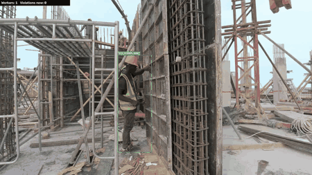
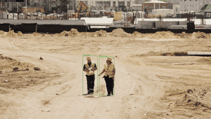

# PPE Detection 🦺👷


A computer vision system for detecting **personal protective equipment**, including
helmets, safety vests, masks, gloves, goggles, and safety shoes, in images and videos.

The system uses **YOLO11** and can run on a CPU, making it suitable for edge devices
and computers without a dedicated GPU.

<p align="center">
  
</p>

<p align="center">
  <em>Real-time helmet compliance monitoring: workers are detected, tracked with stable IDs, and checked for helmet use.</em>
</p>

## Why this project

PPE monitoring is a practical use of computer vision on construction sites, in
factories, and in warehouses.

The goal of this project is to build a complete system rather than only a
model-training notebook:

**data → training → evaluation → optimization → demo → deployment**

## Stack

**Ultralytics YOLO11** · **PyTorch** · **ONNX / onnxruntime** · **OpenCV** ·
**Streamlit**

## Dataset

The base dataset is a public PPE dataset in YOLO format:

[51ddhesh/PPE_Detection](https://huggingface.co/datasets/51ddhesh/PPE_Detection)

The dataset is available under the CC-BY-4.0 licence and contains six classes:

`Gloves`, `Vest`, `goggles`, `helmet`, `mask`, and `safety_shoe`

| Split | Images |
|------:|-------:|
| Train | 8,774 |
| Validation | 2,070 |
| Test | 1,234 |

`src/prepare_data.py` prepares the dataset for training. It:

- extracts the downloaded archive
- changes the paths in `data.yaml` to absolute paths
- checks the number of images in each split
- prints the class names

Absolute paths allow training to work correctly regardless of the directory from
which the command is launched. This also prevents common `"0 images found"` errors.

```bash
curl.exe -L -o data/PPE.zip https://huggingface.co/datasets/51ddhesh/PPE_Detection/resolve/main/PPE.zip
python src/prepare_data.py
```

## Training

I fine-tune **YOLO11s** with transfer learning. The `s` (small) variant is a
deliberate choice: it fits comfortably in 8 GB of VRAM with room to spare and
stays light enough to deploy on CPU later, while still being accurate enough for
the task.

`src/train.py` is tuned for a memory-constrained GPU (my RTX 4060 Laptop, 8 GB):

- **Mixed precision (AMP)** — roughly halves VRAM use and speeds training up
- **Batch 16 at 640px** — fills the card without running out of memory
- **Disk caching** instead of RAM caching — keeps the dataset cache off system RAM
- **Early stopping** — halts a plateaued run so no GPU time is wasted

```bash
python src/train.py --epochs 50
```

The script first confirms it's actually training on the GPU (an easy thing to get
wrong), then trains and copies the best weights to `models/best.pt`.

## Results

Trained for 50 epochs and evaluated on the held-out **test** set (1,234 images
the model never saw during training):

| Metric | Value |
|--------|-------|
| mAP@0.5 | **0.812** |
| mAP@0.5:0.95 | 0.520 |
| Precision | 0.847 |
| Recall | 0.745 |

Per class:

| Class | mAP@0.5 |
|-------|---------|
| goggles | 0.947 |
| Vest | 0.940 |
| helmet | 0.891 |
| safety_shoe | 0.726 |
| mask | 0.718 |
| Gloves | 0.652 |

### What the numbers say

The spread is informative rather than uniform. **Vest, goggles and helmet** score
highest — they're large or visually distinctive and well represented in the data.
**Gloves and masks trail** because they're small, high-variance objects with fewer
training instances (masks in particular have only ~86 test instances, so that
figure is noisier). Precision (0.85) sits above recall (0.75), so the model is a
little conservative — when it fires it's usually right, but it misses some of the
harder small objects. For a safety use case you can trade some precision back for
recall by lowering the confidence threshold.

`src/evaluate.py` produces these metrics along with the confusion matrix and
PR/F1 curves.

<p align="center">
  
</p>

## Improving generalization

The results above are measured on the same dataset the model trained on. To see
how it holds up on **unseen** data, I evaluated it on a *second* public dataset
(Ultralytics Construction-PPE) — and found a big gap:

| Baseline model tested on | mAP@0.5 |
|--------------------------|---------|
| Its own test set | 0.812 |
| An unseen dataset | **0.118** |

That 0.81 → 0.12 collapse showed the model had overfit to a single distribution.
The fix: **merge the second dataset in**, harmonizing its class taxonomy onto ours
(`src/merge_datasets.py` — it remaps the source classes and drops the ones we don't
use). After retraining:

| Test set | Baseline | Merged |
|----------|----------|--------|
| Original | 0.812 | 0.803 |
| Unseen (cross-dataset) | 0.118 | **0.741** |

**Cross-dataset accuracy jumped ~6×** (0.12 → 0.74) for less than a point of
regression on the original test set — far broader real-world robustness at almost
no cost. This merged model is the one used for the demos and deployment.

Honest caveats (full write-up: [`reports/dataset_merge.md`](reports/dataset_merge.md)):
the merge improves *generalization*, not the weak classes on the original
distribution; and the "boots → safety_shoe" mapping is imperfect — I tested
dropping it, which recovered safety_shoe slightly but hurt overall accuracy and
generalization more, so it's kept.

## Optimization for the edge

The point of this step is to answer "can it run somewhere real, and how fast?"
`src/export_onnx.py` exports the trained model to ONNX, produces an INT8-quantized
variant, and benchmarks all three so the trade-offs are measured, not assumed.

| Format | Device | Size (MB) | Latency (ms) | FPS |
|--------|--------|-----------|--------------|-----|
| PyTorch `.pt` | GPU | 18.3 | 7.6 | 131 |
| ONNX FP32 | CPU | 36.2 | 60.9 | 16 |
| ONNX INT8 (dynamic) | CPU | 9.4 | 740 | 1.4 |

### Main findings

- **The model is suitable for edge deployment.**
  After exporting the model to **ONNX FP32**, it runs at around **16 FPS on CPU**, with no dedicated GPU required. This is sufficient for near-real-time PPE monitoring in many edge and industrial applications.

- **Dynamic INT8 quantization reduced model size but increased latency.**
  The quantized model was approximately **4× smaller**, but CPU inference became around **12× slower**. Dynamic quantization is generally more effective for models dominated by matrix multiplication, such as transformers and RNNs. YOLO, however, is mainly convolution-based.

- In this case, ONNX Runtime introduced additional quantize and dequantize operations around the convolution layers. The overhead of these operations was greater than the performance benefit of INT8 computation.

-  A more suitable optimization method would be **static INT8 quantization with calibration data**, which can quantize both weights and activations more efficiently. This is left as future work. For the current deployment, **ONNX FP32** provides the best balance between speed, compatibility, and accuracy on CPU.


Full write-up: [`reports/benchmark.md`](reports/benchmark.md).

## Demo

A Streamlit app (`demo/app.py`) lets you upload an image or a short video and see
the model annotate it live. It runs on the CPU ONNX model, so it works anywhere —
no GPU needed.


*Live detection on an unseen construction-site clip — footage from
[Mixkit](https://mixkit.co/) (free licence), never used in training.*

`src/infer_video.py` runs the same detection from the command line, with
CPU-friendly options (frame-skipping, input downscaling) for smooth inference on
modest hardware:

```bash
streamlit run demo/app.py                            # interactive demo
python src/infer_video.py --source clip.mp4 --frame-skip 2
```

Predictions on held-out test images:


## From detection to compliance

Detection alone says "there's a helmet here." A safety system needs to answer the
real question: **"is this person compliant?"** `src/detect_violations.py` adds that
layer — it pairs a person detector (pretrained COCO model) with the PPE model and
checks whether each detected person has a helmet in their head region, flagging
anyone who doesn't. No retraining required.


*Each person flagged COMPLIANT (green) or NO HELMET (red), on held-out test images.*

It's a deliberately simple spatial heuristic, so it inherits the detector's limits
(a missed helmet reads as a false violation) — but it turns a bounding-box model
into something closer to a usable compliance monitor.

```bash
python src/detect_violations.py --source photo.jpg
```

## Temporal monitoring with tracking

Per-frame compliance answers "who is non-compliant *right now*"; a real monitoring
system needs to follow each worker over time. `src/track_compliance.py` adds
**ByteTrack** multi-object tracking on top — every worker gets a persistent ID,
and the system accumulates a per-worker compliance history, so it reports
*sustained* violations rather than per-frame noise.



*Each worker tracked with a stable ID; a live HUD counts workers and current
violations, with per-worker COMPLIANT / NO HELMET labels. (Footage:
[Pexels](https://www.pexels.com/), unseen during training.)*


*The same pipeline scaling to a busy site — up to 10 workers tracked and
evaluated at once, correctly marking the helmeted workers compliant.*

```bash
python src/track_compliance.py --source clip.mp4
```

Like the compliance layer, it inherits the detector's limits (a missed helmet can
read as a violation), but it turns single-frame detection into worker-level
monitoring over time.


## All experiments — model comparison

Every model I trained, evaluated on the same held-out test sets with one variable
changed at a time. **our-test** is the original 51ddhesh distribution; **cross-dataset**
is a second, unseen dataset (Construction-PPE) that measures real generalization.

| Model | What changed | our-test mAP@0.5 | Cross-dataset mAP@0.5 |
|-------|--------------|:----------------:|:---------------------:|
| Baseline | 51ddhesh only | 0.812 | 0.118 |
| **Merged** ✅ *(deployed)* | + Construction-PPE dataset | 0.803 | **0.741** |
| Augmented | merged + copy-paste / mixup | 0.794 | 0.772 |
| High-res | merged, trained at 960px | 0.802 | 0.742 |
| + Gloves data | merged + 4,663 extra glove images | 0.796 | 0.738 |
| Boots-free | merged, boots→safety_shoe mapping dropped | 0.795 | 0.611 |

Per-class mAP@0.5 on the original test set (best per row in bold):

| Class | Baseline | Merged | Augmented | High-res | +Gloves | Boots-free |
|-------|:--------:|:------:|:---------:|:--------:|:-------:|:----------:|
| goggles | 0.947 | 0.936 | 0.929 | **0.957** | 0.940 | 0.938 |
| Vest | 0.940 | **0.942** | 0.928 | 0.940 | 0.933 | 0.934 |
| helmet | 0.891 | 0.890 | 0.894 | **0.900** | 0.896 | 0.874 |
| safety_shoe | **0.726** | 0.676 | 0.612 | 0.631 | 0.676 | 0.698 |
| mask | 0.718 | 0.720 | **0.768** | 0.754 | 0.701 | 0.705 |
| Gloves | 0.652 | **0.657** | 0.632 | 0.632 | 0.633 | 0.623 |

**Takeaways:**

- The **baseline** looks best on its own test set but collapses on unseen data
  (0.118) — classic overfitting to a single distribution.
- **Merged** is the deployed model: it holds original-test accuracy while lifting
  cross-dataset accuracy ~6×, the best overall trade-off.
- Every attempt to push the weak classes (augmentation, higher resolution, more
  glove data, dropping the boots mapping) either helped one class at another's
  expense or failed to transfer — evidence that the weak classes are limited by
  **data quality, not model capacity**. Full write-up in
  [`reports/REPORT.md`](reports/REPORT.md).

## Author

Sina Mohebbi
